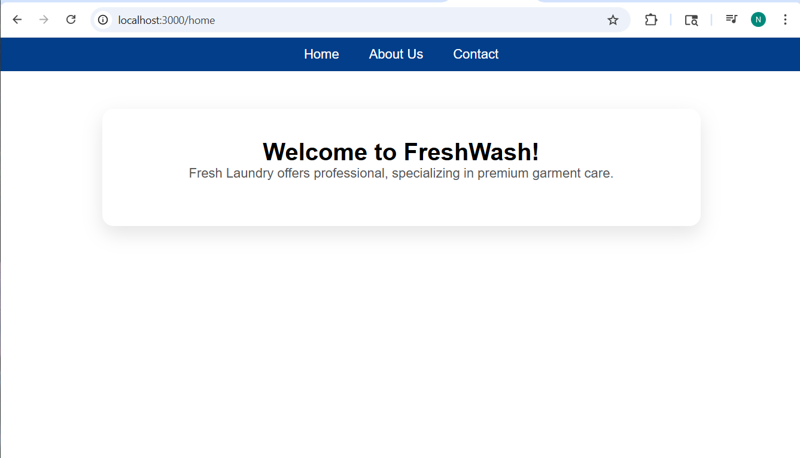
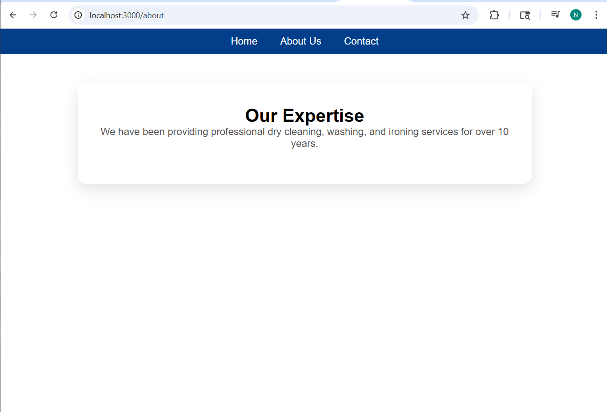
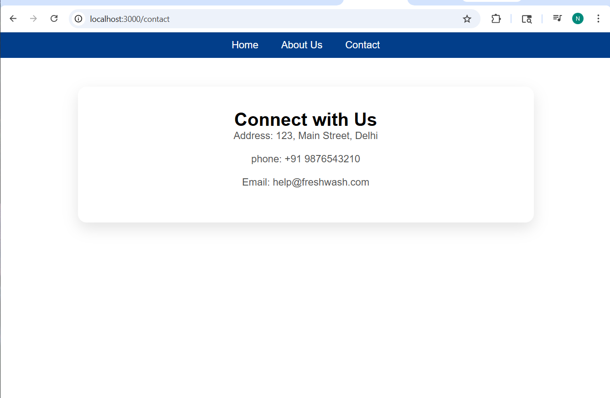
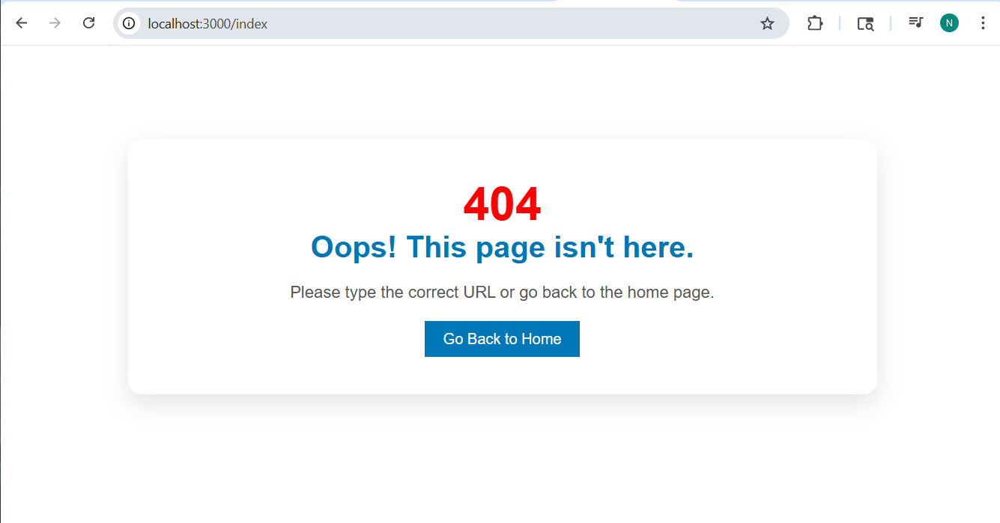
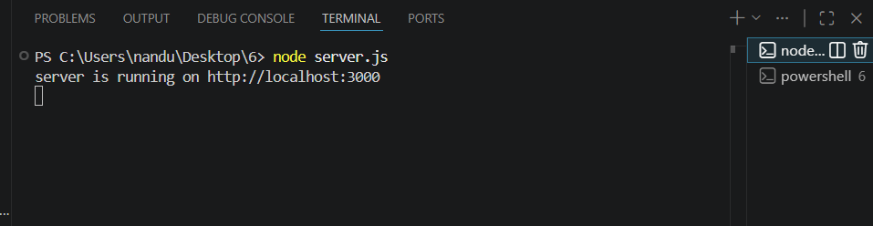

# Assignment 6: Simple Web Server with Node.js

Yeh ek basic web server hai jo Node.js ke built-in `http` module ka upyog karke banaya gaya hai.

## 🛠️ Features
- **Custom Routing**: `/home`, `/about`, aur `/contact` pages.
- **Error Handling**: Custom 404 page galat URLs ke liye.
- **Internal CSS**: Sabhi pages ko ek clean aur professional look dene ke liye.

## 🚀 How to Run 

1. **Node.js Check Karein le liye**:  `node -v`  
2. **File Banayein**: Ek folder banayein aur usmein `server.js` naam ki file banaye.
3. **Server Start Karein**: us folder ka terminal chlakr ye likhe

   node server.js

# Browser Mein Check Karein:
- Home: http://localhost:3000/home
- About: http://localhost:3000/about
- Contact: http://localhost:3000/contact
- Error Test: http://localhost:3000/test (Isse 404 page dikhega)

---

## 📸 Project Screenshots

Yahan mere local server par chalne wale pages ke screenshots hain:

---

## 📸 Project Screenshots

### 1. Home Page

### 2. About Page

### 3. Contact Page

### 4. 404 Error Page

### 5. Server Run Status

